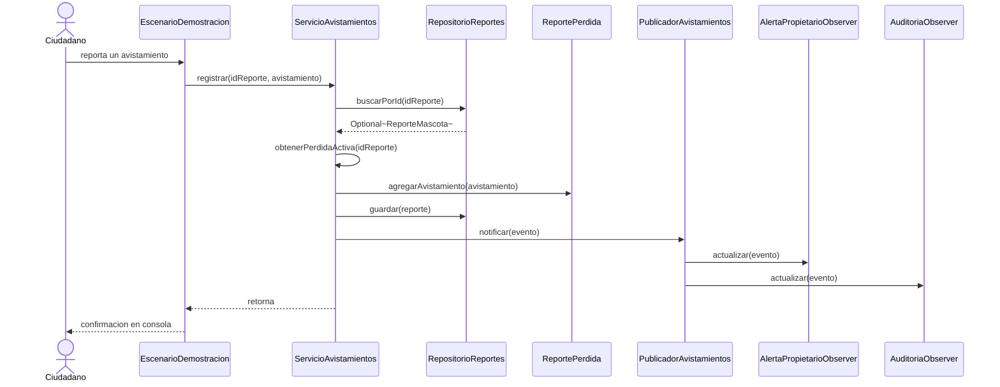

# Pet Finder

Módulo funcional en Java para el Corte 1 de Diseño y Arquitectura de Software.
Universidad de La Sabana, 2026-2.

Red comunitaria de reportes y alertas para mascotas perdidas y encontradas.

---

## 1. Presentación del Problema

### El problema y a quién afecta

Cuando una mascota se pierde, la familia que la busca y la persona que la ve suelen estar a pocas cuadras de distancia sin saberlo. La información que resolvería el caso ya existe: alguien vio al animal, alguien más lo está buscando. Lo que no existe es un canal que las conecte.

Hoy la búsqueda se hace con carteles en postes y mensajes en grupos de WhatsApp del barrio. Los carteles se despegan con la lluvia y solo alcanzan a quien pasa por esa cuadra. En los grupos, el mensaje queda enterrado bajo decenas de conversaciones sobre otros temas en cuestión de horas. Ninguno de los dos medios guarda el reporte, ninguno permite buscarlo después, y ninguno le avisa al dueño cuando alguien aporta una pista.

El resultado es que un vecino que vio a la mascota se queda con la información y no sabe a quién dársela. La pista se pierde no por falta de solidaridad, sino por falta de conexión.

Afecta directamente a las familias que pierden una mascota y a los vecinos que quieren ayudar y no encuentran cómo. Indirectamente afecta a las fundaciones de rescate, que reciben animales cuyo dueño está buscándolos activamente en otro canal.

### Por qué se resuelve con software

El problema no es de esfuerzo ni de voluntad: es de información dispersa y sin canal común. Ese es exactamente el tipo de problema que el software resuelve mejor que cualquier otro medio, porque requiere tres cosas que un cartel no puede dar:

- **Persistencia:** el reporte sigue disponible días después, no depende de que alguien pase por esa esquina
- **Búsqueda:** se puede consultar por identificador y filtrar por estado, en vez de revisar un historial de chat
- **Notificación dirigida:** cuando entra una pista, el sistema le avisa a quien le interesa, sin depender de que el dueño esté leyendo el grupo en ese momento

### Alcance de este módulo

Este corte implementa un **módulo funcional en Java que corre en consola y almacena los datos en memoria**. Es el núcleo de reglas de negocio del sistema: la lógica que decide qué reportes se pueden crear, qué operaciones son válidas sobre ellos y a quién se notifica cuando entra un avistamiento.

Lo que **sí** hace este módulo:

- Registrar reportes de mascota perdida y de mascota encontrada
- Listar los reportes activos y consultar uno por su identificador
- Registrar avistamientos sobre un reporte de pérdida activo
- Notificar a varios interesados cuando entra un avistamiento, con suscripción y desuscripción
- Cambiar el estado de un reporte a resuelto o cerrado, respetando las transiciones válidas
- Rechazar operaciones inválidas con mensajes de error claros

Lo que queda **fuera de alcance** de este corte:

Interfaz web o aplicación móvil, mapa y coordenadas GPS, base de datos, autenticación de usuarios, carga de imágenes, envío real de correos o notificaciones push, reconocimiento de imágenes con IA, emparejamiento automático entre pérdidas y hallazgos, moderación de contenido y despliegue en la nube.

La aplicación con mapa y notificaciones reales es la visión futura del proyecto. Aparece en el cómic como aspiración, pero no se presenta como implementada.

---

## 2. Creatividad en la Presentación

Cómic de siete viñetas que explica el problema desde la experiencia de dos personas que nunca llegan a encontrarse: quien perdió a su mascota y quien la vio.

[Ver el cómic](docs/comic/pet-finder-comic.pdf)

El cómic no muestra la aplicación. Termina planteando la pregunta que el proyecto responde: la información existía en los dos lados, el canal no.

---

## 3. Fundamentos de Ingeniería de Software

Cada atributo declarado aquí está sostenido por una decisión concreta del diseño y tiene un costo que se asume de forma explícita.

| Atributo de calidad | ¿Cómo se sostiene en el diseño? | ¿Qué se sacrificó a cambio? |
|---|---|---|
| **Mantenibilidad** | Las responsabilidades están separadas por razón de cambio: `CreadorReporte` sabe crear, `ServicioReportes` maneja el ciclo de vida, `ServicioAvistamientos` maneja las pistas, `PublicadorAvistamientos` distribuye eventos. Cambiar el formato de una alerta toca una sola clase y no compila nada más | El módulo tiene 30 clases para una funcionalidad que cabría en cinco. Seguir un flujo completo obliga a abrir cuatro o cinco archivos, y alguien nuevo tarda más en entender el recorrido de una operación |
| **Extensibilidad** | Un tipo de reporte nuevo se agrega creando una subclase de `ReporteMascota`, una de `CreadorReporte` y registrando una línea en `Main`. Un receptor de alertas nuevo se agrega implementando `ObservadorAvistamiento`. Ninguna clase existente se modifica | La jerarquía de creadores es más código que un condicional, y agregar un tipo obliga a tocar tres lugares en vez de uno. La ganancia solo aparece cuando el sistema efectivamente crece; en un sistema que nunca cambia, esto es sobrecosto |
| **Testabilidad** | `ServicioReportes` y `ServicioAvistamientos` dependen de la interfaz `RepositorioReportes`, no de la implementación. Las once pruebas corren sin infraestructura real y verifican reglas de negocio, no detalles de almacenamiento | El ensamblaje de dependencias se hace a mano en `Main`, que crece cada vez que se agrega un componente. Sin un contenedor de inyección, esa clase es el punto que más se ensucia |
| **Integridad de los datos** | La validación ocurre en tres niveles: datos comunes en `CreadorReporte`, datos propios del tipo en cada creador concreto, y transiciones de estado en la propia entidad. `getAvistamientos()` devuelve una lista inmodificable para que nadie agregue elementos saltándose la validación | La verificación de estado está duplicada a propósito entre `ServicioAvistamientos` y `ReportePerdida`. Si esa regla cambia, hay que actualizarla en dos lugares. Se aceptó el costo porque la entidad no puede confiar en que quien la llame haya validado |

### Atributos que este módulo no puede afirmar

**Escalabilidad, disponibilidad y reusabilidad externa.** No hay evidencia que las sustente: el almacenamiento es en memoria, no hay servicio desplegado y ningún componente se usa fuera de este proyecto. Declararlas sería una afirmación sin respaldo. Son metas del sistema completo, no cualidades demostradas de este módulo.

---

## 4. Diseño de Software

### 4.1 Principios SOLID aplicados

#### SRP — Principio de responsabilidad única (con evidencia antes y después)

```java
// ANTES (violación): una sola clase concentraba cuatro razones de cambio
class GestorReportes {
    private List<ReporteMascota> reportes = new ArrayList<>();

    ReporteMascota crear(String tipo, ...) {
        if (tipo.equals("PERDIDA")) {
            return new ReportePerdida(...);      // razón de cambio 1: nuevo tipo de reporte
        } else {
            return new ReporteEncontrada(...);
        }
    }

    void agregarAvistamiento(String id, Avistamiento a) {
        ReporteMascota r = buscar(id);
        // razón de cambio 2: reglas de qué reporte admite avistamientos
        ((ReportePerdida) r).agregarAvistamiento(a);

        // razón de cambio 3: formato y medio de la alerta
        System.out.println("ALERTA: nueva pista sobre " + id);

        // razón de cambio 4: forma de almacenar
        reportes.add(r);
    }
}
```

Problema concreto: si mañana la alerta debe enviarse por correo en lugar de imprimirse, hay que modificar la misma clase que decide qué tipos de reporte existen. Si se agrega un tercer tipo de reporte, hay que modificar la clase que sabe imprimir alertas. Cuatro motivos distintos para tocar el mismo archivo, y cada cambio arriesga romper algo que no tiene relación.

```java
// DESPUÉS: cada responsabilidad en su propia clase
CreadorReporte           // crear reportes y validar los datos de entrada
ServicioReportes         // ciclo de vida: registrar, consultar, resolver, cerrar
ServicioAvistamientos    // reglas de avistamiento y publicación del evento
PublicadorAvistamientos  // distribuir el evento a los interesados
AlertaPropietarioObserver / AuditoriaObserver  // cómo reacciona cada uno
RepositorioReportes      // contrato de almacenamiento
```

Por qué resuelve el problema: cambiar el formato de la alerta ahora toca únicamente `AlertaPropietarioObserver`. Agregar un tipo de reporte toca una subclase nueva y una línea en `Main`. Cambiar el almacenamiento toca una implementación nueva de `RepositorioReportes`. Ninguna de esas tres modificaciones obliga a recompilar ni a releer las otras.

#### OCP — Principio abierto/cerrado

Dónde se aplica: en las jerarquías `CreadorReporte` y `ObservadorAvistamiento`.

`ServicioReportes` recibe un `Map<TipoReporte, CreadorReporte>` armado en `Main`. Para agregar un tipo de reporte se crea el producto, su creador y se registra una entrada en ese mapa. `ServicioReportes` no cambia. Lo mismo del lado de las alertas: `PublicadorAvistamientos` recorre una lista de `ObservadorAvistamiento` sin conocer los tipos concretos, así que agregar un canal de notificación es escribir una clase nueva y suscribirla.

Por qué esa decisión y no otra: la alternativa era un `switch (tipo)` dentro de una fábrica única. Funciona, pero cada tipo nuevo obliga a modificar ese condicional, que es precisamente lo que OCP busca evitar. El mapa traslada la decisión al punto de ensamblaje, donde configurar es lo esperado.

Detalle de diseño relacionado: `ServicioReportes.registrar` recibe el enum `TipoReporte`, no un `CreadorReporte` ya construido. Si recibiera el creador, la interfaz de usuario tendría que decidir cuál instanciar y el condicional reaparecería ahí. El punto de decisión queda en un solo lugar, `Main`.

#### DIP — Principio de inversión de dependencias

Dónde se aplica: `ServicioReportes` y `ServicioAvistamientos` dependen de la interfaz `RepositorioReportes`, nunca de `RepositorioReportesEnMemoria`. La implementación concreta se inyecta por constructor desde `Main`.

Evidencia verificable: buscar la palabra `infrastructure` en todo el proyecto devuelve exactamente dos archivos, la implementación del repositorio y `Main`. Ninguna clase de `domain` ni de `application` conoce el paquete de infraestructura.

Por qué esa decisión y no otra: el almacenamiento es la frontera de sustitución real del sistema. Cambiar memoria por base de datos es la extensión más previsible, y la interfaz permite hacerlo sin tocar la lógica de negocio. Además hace las pruebas posibles sin infraestructura.

Dónde **no** se aplicó y por qué: `GeneradorIdReportes` es una clase concreta. No existe una segunda forma de generar identificadores en este alcance ni razón para sustituirla en pruebas. Crear la interfaz por si acaso sería generalidad especulativa. DIP se aplica donde hay una frontera real de sustitución, no en todas partes.

### 4.2 Patrones de diseño utilizados

| Patrón | Categoría | Problema que resuelve aquí | Alternativa descartada y por qué |
|---|---|---|---|
| **Factory Method** | Creacional | Crear `ReportePerdida` y `ReporteEncontrada` con validaciones distintas, sin que el código cliente conozca las clases concretas. Cada creador valida lo suyo: una pérdida exige la mascota identificada, un hallazgo exige una descripción libre del animal | Se descartó **Abstract Factory** porque no hay familias de objetos relacionados que deban crearse en conjunto, solo variantes de un mismo producto. Se descartó también la **fábrica simple con un condicional**, porque cada tipo nuevo obligaría a modificar ese condicional y violaría OCP |
| **Observer** | Comportamiento | Notificar a varios interesados cuando entra un avistamiento, sin que `ServicioAvistamientos` conozca cuántos son ni qué hacen. Hoy son dos —alerta al propietario y registro de auditoría— y reaccionan de forma distinta al mismo evento | Se descartó un **bus de eventos asíncrono con colas** porque el volumen es bajo y el módulo corre en un solo proceso; esa complejidad no se justifica. Se descartó también **poner la lista de observadores dentro de `ReportePerdida`**, porque mezclaría la entidad de dominio con el mecanismo de notificación y rompería SRP |

#### Participantes de Factory Method

| Rol | Clase |
|---|---|
| Producto | `ReporteMascota` |
| Productos concretos | `ReportePerdida`, `ReporteEncontrada` |
| Creador | `CreadorReporte` |
| Creadores concretos | `CreadorReportePerdida`, `CreadorReporteEncontrada` |
| Cliente | `ServicioReportes`, configurado desde `Main` |

`CreadorReporte.preparar()` es `final` a propósito: define el orden validar, generar identificador y construir. Si una subclase pudiera sobrescribirlo, podría construir un reporte sin validar. El método fábrica `crearReporte()` es `protected`, de modo que nadie fuera de la jerarquía instancia un reporte saltándose la validación.

#### Participantes de Observer

| Rol | Clase |
|---|---|
| Publicador | `PublicadorAvistamientos` |
| Suscriptor | `ObservadorAvistamiento` |
| Suscriptores concretos | `AlertaPropietarioObserver`, `AuditoriaObserver` |
| Contexto del evento | `EventoAvistamiento` |
| Cliente que configura las suscripciones | `Main` |

La evidencia de que el patrón está implementado y no solo mencionado es la desuscripción: existe un caso de prueba que retira un observador y verifica que el siguiente evento llega únicamente al que quedó suscrito.

### 4.3 Modelado UML

Los diagramas están embebidos con Mermaid, que GitHub renderiza de forma nativa. Los archivos fuente están en [`docs/uml/`](docs/uml/).

#### Diagrama de clases

```mermaid
classDiagram
    direction TB

    class ReporteMascota {
        <<abstract>>
        -String id
        -LocalDateTime fechaCreacion
        -Ubicacion ubicacion
        -String descripcion
        -EstadoReporte estado
        +resolver()
        +cerrar()
        +estaActivo() boolean
        +resumen() String
        -cambiarEstado(EstadoReporte)
    }

    class ReportePerdida {
        -Mascota mascota
        -Contacto contactoPropietario
        -List~Avistamiento~ avistamientos
        +agregarAvistamiento(Avistamiento)
        +getAvistamientos() List~Avistamiento~
        +resumen() String
    }

    class ReporteEncontrada {
        -String descripcionMascota
        -Contacto contactoReportante
        +getDescripcionMascota() String
        +getContactoReportante() Contacto
        +resumen() String
    }

    class EstadoReporte {
        <<enumeration>>
        ACTIVO
        RESUELTO
        CERRADO
        +permiteTransicionA(EstadoReporte) boolean
    }

    class TipoReporte {
        <<enumeration>>
        PERDIDA
        ENCONTRADA
    }

    class Mascota {
        <<record>>
        -String nombre
        -String especie
        -String raza
        -String color
        -String senasParticulares
    }

    class Ubicacion {
        <<record>>
        -String zonaOBarrio
        -String referencia
    }

    class Contacto {
        <<record>>
        -String nombre
        -String medioContacto
    }

    class Avistamiento {
        <<record>>
        -String id
        -LocalDateTime fechaHora
        -Ubicacion ubicacion
        -String descripcion
        -Contacto contactoReportante
    }

    class SolicitudReporte {
        <<record>>
        -Ubicacion ubicacion
        -String descripcion
        -Contacto contacto
        -Mascota mascota
        -String descripcionMascota
        +paraPerdida(...) SolicitudReporte
        +paraEncontrada(...) SolicitudReporte
    }

    class GeneradorIdReportes {
        -int secuencia
        +siguiente() String
    }

    class CreadorReporte {
        <<abstract>>
        -GeneradorIdReportes generador
        +preparar(SolicitudReporte) ReporteMascota
        #crearReporte(SolicitudReporte, String) ReporteMascota
        -validarDatosComunes(SolicitudReporte)
        #esVacio(String) boolean
    }

    class CreadorReportePerdida {
        #crearReporte(SolicitudReporte, String) ReporteMascota
    }

    class CreadorReporteEncontrada {
        #crearReporte(SolicitudReporte, String) ReporteMascota
    }

    class RepositorioReportes {
        <<interface>>
        +guardar(ReporteMascota)
        +buscarPorId(String) Optional~ReporteMascota~
        +listarActivos() List~ReporteMascota~
    }

    class RepositorioReportesEnMemoria {
        -Map~String,ReporteMascota~ reportes
        +guardar(ReporteMascota)
        +buscarPorId(String) Optional~ReporteMascota~
        +listarActivos() List~ReporteMascota~
    }

    class ServicioReportes {
        -RepositorioReportes repositorio
        -Map~TipoReporte,CreadorReporte~ creadores
        +registrar(TipoReporte, SolicitudReporte) ReporteMascota
        +listarActivos() List~ReporteMascota~
        +consultar(String) ReporteMascota
        +resolver(String)
        +cerrar(String)
        -buscarOFallar(String) ReporteMascota
    }

    class ServicioAvistamientos {
        -RepositorioReportes repositorio
        -PublicadorAvistamientos publicador
        +registrar(String, Avistamiento)
        -obtenerPerdidaActiva(String) ReportePerdida
    }

    class PublicadorAvistamientos {
        -List~ObservadorAvistamiento~ observadores
        +suscribir(ObservadorAvistamiento)
        +desuscribir(ObservadorAvistamiento)
        +notificar(EventoAvistamiento)
    }

    class ObservadorAvistamiento {
        <<interface>>
        +actualizar(EventoAvistamiento)
    }

    class AlertaPropietarioObserver {
        +actualizar(EventoAvistamiento)
    }

    class AuditoriaObserver {
        -List~String~ registro
        +actualizar(EventoAvistamiento)
        +getRegistro() List~String~
    }

    class EventoAvistamiento {
        <<record>>
        -String idReporte
        -String nombreMascota
        -Avistamiento avistamiento
        -LocalDateTime fechaHora
    }

    class DominioException {
        <<abstract>>
        +DominioException(String)
    }

    class DatosInvalidosException
    class ReporteNoEncontradoException
    class OperacionNoPermitidaException

    class EscenarioDemostracion {
        +ejecutar()
    }

    class MenuConsola {
        -Scanner entrada
        +ejecutar()
    }

    class Main {
        +main(String[])
    }

    ReporteMascota <|-- ReportePerdida
    ReporteMascota <|-- ReporteEncontrada
    ReporteMascota *-- Ubicacion
    ReporteMascota --> EstadoReporte
    ReportePerdida *-- Mascota
    ReportePerdida *-- Contacto
    ReportePerdida o-- Avistamiento
    ReporteEncontrada *-- Contacto
    Avistamiento *-- Ubicacion

    CreadorReporte <|-- CreadorReportePerdida
    CreadorReporte <|-- CreadorReporteEncontrada
    CreadorReporte --> GeneradorIdReportes
    CreadorReporte ..> SolicitudReporte
    CreadorReporte ..> ReporteMascota : crea
    CreadorReportePerdida ..> ReportePerdida : instancia
    CreadorReporteEncontrada ..> ReporteEncontrada : instancia

    RepositorioReportes <|.. RepositorioReportesEnMemoria
    RepositorioReportes ..> ReporteMascota

    ServicioReportes --> RepositorioReportes
    ServicioReportes --> CreadorReporte
    ServicioReportes ..> TipoReporte
    ServicioReportes ..> SolicitudReporte
    ServicioAvistamientos --> RepositorioReportes
    ServicioAvistamientos --> PublicadorAvistamientos
    ServicioAvistamientos ..> ReportePerdida
    ServicioAvistamientos ..> EventoAvistamiento

    PublicadorAvistamientos o-- ObservadorAvistamiento
    PublicadorAvistamientos ..> EventoAvistamiento
    ObservadorAvistamiento <|.. AlertaPropietarioObserver
    ObservadorAvistamiento <|.. AuditoriaObserver
    EventoAvistamiento *-- Avistamiento

    DominioException <|-- DatosInvalidosException
    DominioException <|-- ReporteNoEncontradoException
    DominioException <|-- OperacionNoPermitidaException

    EscenarioDemostracion --> ServicioReportes
    EscenarioDemostracion --> ServicioAvistamientos
    EscenarioDemostracion --> PublicadorAvistamientos
    MenuConsola --> ServicioReportes
    MenuConsola --> ServicioAvistamientos
    Main ..> EscenarioDemostracion
    Main ..> MenuConsola
    Main ..> CreadorReporte
    Main ..> ObservadorAvistamiento
    Main ..> RepositorioReportesEnMemoria
```



#### Diagrama de secuencia: registro de un avistamiento



Si el reporte no existe, no es de tipo pérdida o ya no está activo, `obtenerPerdidaActiva` lanza la excepción y corta el flujo antes de guardar y antes de publicar. Nunca se notifica a nadie por una operación que falló.

#### Tabla de trazabilidad

Ruta base del código: `src/main/java/petfinder/`

| Clase en el diagrama | Archivo en el repositorio | Coincide |
|---|---|---|
| `ReporteMascota` | [`domain/model/ReporteMascota.java`](src/main/java/petfinder/domain/model/ReporteMascota.java) | Sí |
| `ReportePerdida` | [`domain/model/ReportePerdida.java`](src/main/java/petfinder/domain/model/ReportePerdida.java) | Sí |
| `ReporteEncontrada` | [`domain/model/ReporteEncontrada.java`](src/main/java/petfinder/domain/model/ReporteEncontrada.java) | Sí |
| `EstadoReporte` | [`domain/model/EstadoReporte.java`](src/main/java/petfinder/domain/model/EstadoReporte.java) | Sí |
| `TipoReporte` | [`domain/model/TipoReporte.java`](src/main/java/petfinder/domain/model/TipoReporte.java) | Sí |
| `Mascota` | [`domain/model/Mascota.java`](src/main/java/petfinder/domain/model/Mascota.java) | Sí |
| `Ubicacion` | [`domain/model/Ubicacion.java`](src/main/java/petfinder/domain/model/Ubicacion.java) | Sí |
| `Contacto` | [`domain/model/Contacto.java`](src/main/java/petfinder/domain/model/Contacto.java) | Sí |
| `Avistamiento` | [`domain/model/Avistamiento.java`](src/main/java/petfinder/domain/model/Avistamiento.java) | Sí |
| `SolicitudReporte` | [`domain/model/SolicitudReporte.java`](src/main/java/petfinder/domain/model/SolicitudReporte.java) | Sí |
| `GeneradorIdReportes` | [`domain/model/GeneradorIdReportes.java`](src/main/java/petfinder/domain/model/GeneradorIdReportes.java) | Sí |
| `CreadorReporte` | [`domain/factory/CreadorReporte.java`](src/main/java/petfinder/domain/factory/CreadorReporte.java) | Sí |
| `CreadorReportePerdida` | [`domain/factory/CreadorReportePerdida.java`](src/main/java/petfinder/domain/factory/CreadorReportePerdida.java) | Sí |
| `CreadorReporteEncontrada` | [`domain/factory/CreadorReporteEncontrada.java`](src/main/java/petfinder/domain/factory/CreadorReporteEncontrada.java) | Sí |
| `RepositorioReportes` | [`domain/repository/RepositorioReportes.java`](src/main/java/petfinder/domain/repository/RepositorioReportes.java) | Sí |
| `RepositorioReportesEnMemoria` | [`infrastructure/persistence/RepositorioReportesEnMemoria.java`](src/main/java/petfinder/infrastructure/persistence/RepositorioReportesEnMemoria.java) | Sí |
| `PublicadorAvistamientos` | [`domain/observer/PublicadorAvistamientos.java`](src/main/java/petfinder/domain/observer/PublicadorAvistamientos.java) | Sí |
| `ObservadorAvistamiento` | [`domain/observer/ObservadorAvistamiento.java`](src/main/java/petfinder/domain/observer/ObservadorAvistamiento.java) | Sí |
| `AlertaPropietarioObserver` | [`domain/observer/AlertaPropietarioObserver.java`](src/main/java/petfinder/domain/observer/AlertaPropietarioObserver.java) | Sí |
| `AuditoriaObserver` | [`domain/observer/AuditoriaObserver.java`](src/main/java/petfinder/domain/observer/AuditoriaObserver.java) | Sí |
| `EventoAvistamiento` | [`domain/observer/EventoAvistamiento.java`](src/main/java/petfinder/domain/observer/EventoAvistamiento.java) | Sí |
| `DominioException` | [`domain/exception/DominioException.java`](src/main/java/petfinder/domain/exception/DominioException.java) | Sí |
| `DatosInvalidosException` | [`domain/exception/DatosInvalidosException.java`](src/main/java/petfinder/domain/exception/DatosInvalidosException.java) | Sí |
| `ReporteNoEncontradoException` | [`domain/exception/ReporteNoEncontradoException.java`](src/main/java/petfinder/domain/exception/ReporteNoEncontradoException.java) | Sí |
| `OperacionNoPermitidaException` | [`domain/exception/OperacionNoPermitidaException.java`](src/main/java/petfinder/domain/exception/OperacionNoPermitidaException.java) | Sí |
| `ServicioReportes` | [`application/ServicioReportes.java`](src/main/java/petfinder/application/ServicioReportes.java) | Sí |
| `ServicioAvistamientos` | [`application/ServicioAvistamientos.java`](src/main/java/petfinder/application/ServicioAvistamientos.java) | Sí |
| `EscenarioDemostracion` | [`ui/EscenarioDemostracion.java`](src/main/java/petfinder/ui/EscenarioDemostracion.java) | Sí |
| `MenuConsola` | [`ui/MenuConsola.java`](src/main/java/petfinder/ui/MenuConsola.java) | Sí |
| `Main` | [`Main.java`](src/main/java/petfinder/Main.java) | Sí |

---

## 5. Implementación

### Estructura de paquetes

```
src/main/java/petfinder/
├── Main.java                    Punto de entrada y ensamblaje de dependencias
├── ui/                          Demostración automática y menú interactivo
├── application/                 Casos de uso: los dos servicios
├── domain/
│   ├── model/                   Entidades, enums y objetos de valor
│   ├── factory/                 Factory Method
│   ├── observer/                Publicador, evento y observadores
│   ├── repository/              Contrato de almacenamiento
│   └── exception/               Excepciones de negocio
└── infrastructure/
    └── persistence/             Implementación del repositorio en memoria

src/test/java/petfinder/application/
├── ServicioReportesTest.java        5 casos
└── ServicioAvistamientosTest.java   6 casos
```

La separación no es decorativa: cada paquete tiene una razón de cambio distinta, y las dependencias apuntan siempre hacia el dominio. `domain` no conoce a `infrastructure` ni a `ui`.

### Dónde ver cada patrón y principio

| Qué buscar | Dónde |
|---|---|
| Factory Method | [`domain/factory/`](src/main/java/petfinder/domain/factory/) |
| Observer | [`domain/observer/`](src/main/java/petfinder/domain/observer/) |
| SRP | Comparar `ServicioReportes` y `ServicioAvistamientos` en [`application/`](src/main/java/petfinder/application/) |
| OCP | El mapa de creadores y las suscripciones en [`Main.java`](src/main/java/petfinder/Main.java) |
| DIP | [`domain/repository/RepositorioReportes.java`](src/main/java/petfinder/domain/repository/RepositorioReportes.java) frente a su implementación en `infrastructure` |
| Reglas de estado | [`domain/model/EstadoReporte.java`](src/main/java/petfinder/domain/model/EstadoReporte.java) |

### Ejecución

Las instrucciones completas están en [`README_TECNICO.md`](README_TECNICO.md). En resumen:

```bash
mvn compile exec:java                        # demostración automática
mvn compile exec:java -Dexec.args="--menu"   # menú interactivo
mvn test                                     # las once pruebas
```

---

## 6. Análisis Técnico

### Alta cohesión

`ReportePerdida` solo sabe de mascotas perdidas y sus avistamientos. `PublicadorAvistamientos` solo sabe mantener una lista de suscriptores y recorrerla. `RepositorioReportesEnMemoria` solo sabe guardar y buscar. Ninguna de estas clases tiene un método que sobre si se lee su nombre.

El caso más claro es `EstadoReporte`: las reglas de transición viven dentro del enum, no repartidas por los servicios. Preguntar si un cambio de estado es válido es una sola llamada, en un solo lugar.

### Bajo acoplamiento

Se mide en algo verificable: las once pruebas de `ServicioReportes` y `ServicioAvistamientos` corren sin base de datos, sin red y sin entrada de usuario. Eso solo es posible porque los servicios dependen de la interfaz `RepositorioReportes` y no de una implementación concreta.

Segunda evidencia: buscar `infrastructure` en todo el proyecto devuelve dos archivos. Las clases de negocio no conocen el paquete de infraestructura.

Tercera: `PublicadorAvistamientos` no importa ninguna de las dos clases de observador concreto. Solo conoce la interfaz.

### Extensiones que este diseño facilita

- **Un canal de notificación nuevo** (correo, SMS, push): una clase que implemente `ObservadorAvistamiento` y una línea de suscripción en `Main`
- **Un tipo de reporte nuevo** (por ejemplo, mascota en adopción): un producto, un creador y una entrada en el mapa
- **Persistencia en base de datos**: una implementación nueva de `RepositorioReportes`, sin tocar los servicios ni las pruebas de negocio
- **Otra interfaz de usuario** (web, API REST): los servicios ya son independientes de la consola

### Límites honestos del diseño

- **Verificación de tipo en tiempo de ejecución.** `ServicioAvistamientos` usa `instanceof` para confirmar que el reporte es de tipo pérdida, porque solo ese tipo admite avistamientos. Es el costo de modelar los dos reportes como hermanos en una jerarquía. Está contenido en un único método privado, `obtenerPerdidaActiva`, y no repartido por el código. La alternativa era un repositorio especializado por tipo, que duplicaría el almacenamiento.
- **Sin concurrencia.** El repositorio en memoria no es seguro para múltiples hilos. Cualquier versión multiusuario exigiría revisar ese punto.
- **Sin emparejamiento automático.** El sistema no cruza reportes de pérdida con reportes de hallazgo. Esa función requeriría criterios de similitud que quedaron fuera de alcance.
- **Validación duplicada.** La verificación de estado existe en el servicio y en la entidad. Fue una decisión consciente para que la entidad proteja su propia regla, pero implica mantener dos lugares sincronizados.
- **El ensamblaje manual crece.** `Main` construye todas las dependencias a mano. Con más componentes, esa clase se vuelve el punto más incómodo del proyecto.

---

## 7. Créditos y Roles

| Integrante | Rol y contribución principal |
|---|---|
| **Santiago Escobar** | Modelo de dominio y Factory Method. Excepciones de negocio, entidades con reglas de estado, objetos de valor y la jerarquía de creadores. Documentación de principios SOLID. Configuración inicial del repositorio y modelado UML |
| **Mateo Ramírez** | Persistencia y patrón Observer. Contrato `RepositorioReportes`, implementación en memoria, publicador, interfaz de suscriptores y los dos observadores concretos. Documentación de patrones de diseño |
| **Antonio Benítez** | Capa de aplicación e interfaz. Los dos servicios de casos de uso, demostración automática, menú interactivo y las once pruebas JUnit. Presentación del problema, atributos de calidad y análisis técnico. Coordinación del cómic |

El historial de commits del repositorio refleja la contribución de cada integrante.
