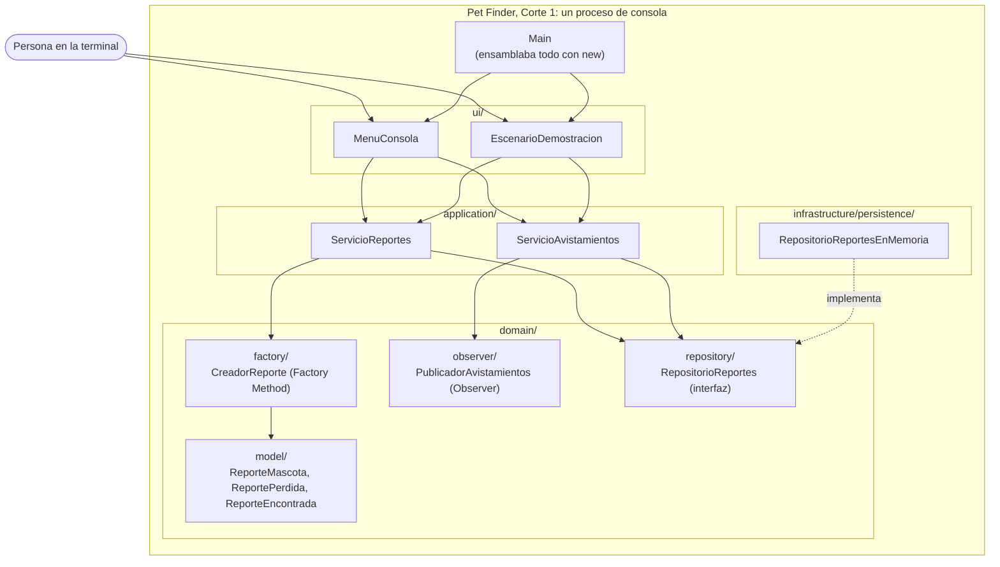
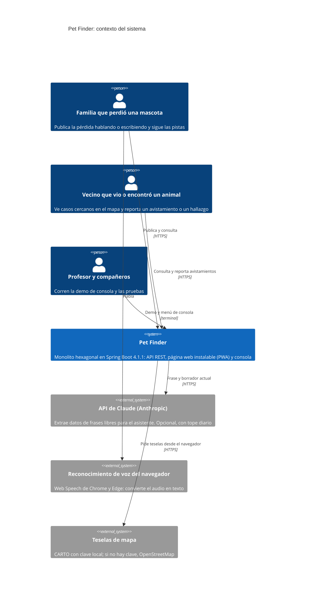
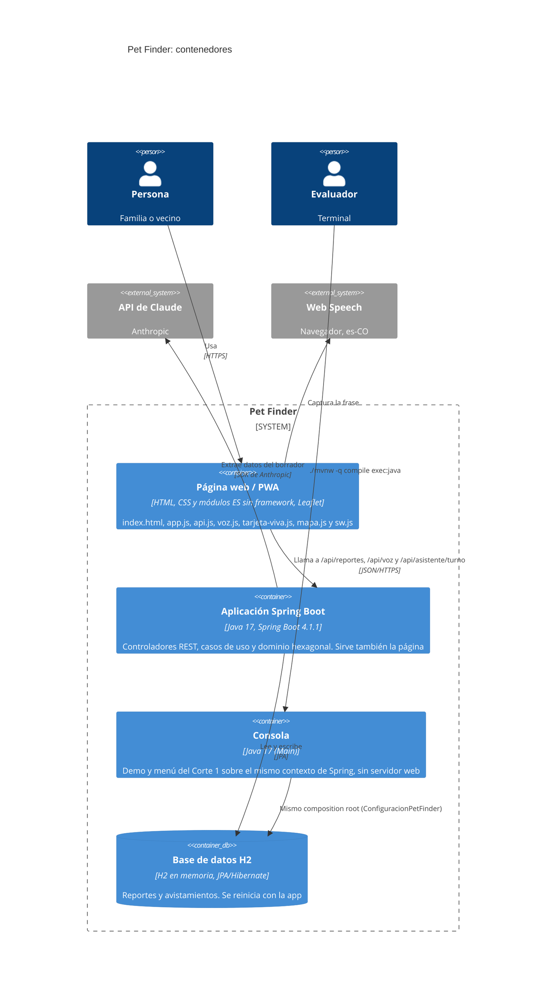
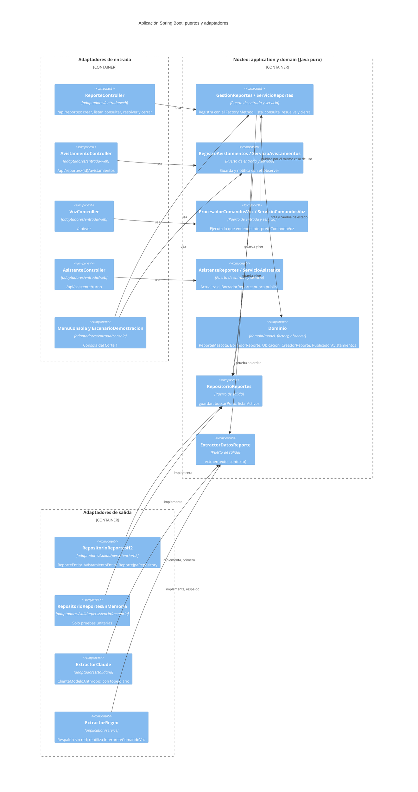

# Diagramas de arquitectura: Corte 1 frente a Corte 2

Todos los nombres de estos diagramas existen en `src/main/java/petfinder/` o en `src/main/resources/static/`. GitHub dibuja los bloques Mermaid directamente.

## Arquitectura inicial (Corte 1)

Un proceso de consola en capas. `Main` armaba todo a mano y la dependencia iba de arriba hacia abajo, con el repositorio ya expresado como interfaz. El diagrama de clases completo está en [`docs/uml/diagrama-clases.mmd`](../uml/diagrama-clases.mmd).

**Qué cambió en el Corte 2:** `ui/` pasó a `adaptadores/entrada/consola/`, `infrastructure/persistence/` a `adaptadores/salida/persistencia/memoria/`, y `domain/repository/RepositorioReportes` a `application/port/salida/`. Los servicios ahora implementan puertos de entrada. Los movimientos se hicieron con `git mv` en la tarea E1-T2 (tag `step-04-hexagonal`), así que cada archivo conserva su historia.

## Arquitectura evolucionada (Corte 2)

### Nivel 1: contexto

### Nivel 2: contenedores

### Nivel 3: componentes de la aplicación

Los adaptadores de entrada solo conocen puertos de entrada; los servicios solo conocen puertos de salida. `config/` (`ConfiguracionPetFinder`, `ConfiguracionAsistente`, `ConfiguracionIa`) es el único lugar que conecta cada puerto con su implementación.

## Lo que muestran los dos diagramas juntos

- **Los mismos casos de uso, cuatro entradas.** Consola, formulario web, voz y asistente llegan a `GestionReportes`. La prueba `FlujoVozSistemaIT.vozFormularioYAsistenteProducenElMismoReporte` lo comprueba por HTTP.
- **Dos salidas intercambiables por puerto.** Memoria o H2 detrás de `RepositorioReportes`; Claude o regex detrás de `ExtractorDatosReporte`.
- **El dominio no se reescribió.** Ganó reconstrucción (`reconstruir(...)`), coordenadas en `Ubicacion` y `BorradorReporte`, pero el Factory Method, el Observer y las transiciones de `EstadoReporte` son los del Corte 1.
